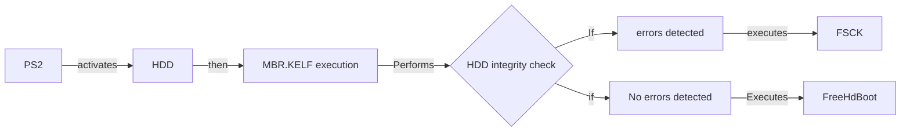
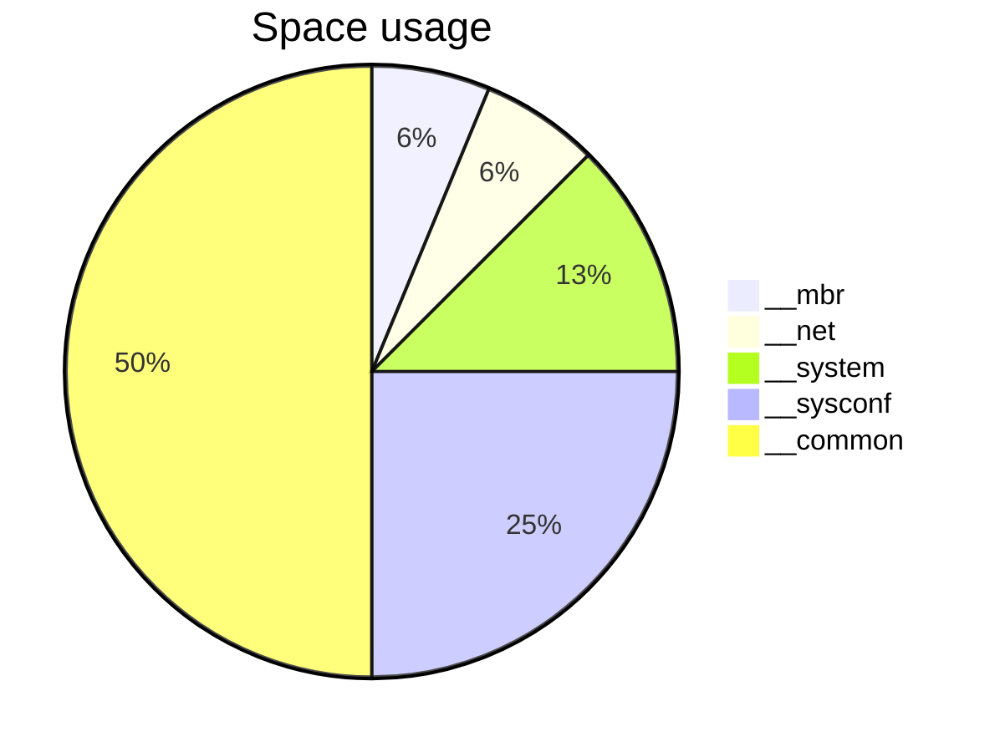
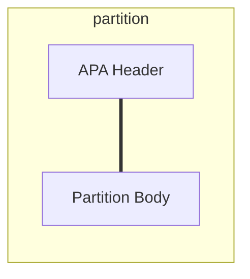

# extra information 

## FreeHdBoot startup

## Space usage on freshly formatted drive

## Partition layout

- APA Header
a ~5Mb area wich can holds special files, commonly used for displaying nad executing software, via HDD-OSD or PSBBN
Contents can be:
- icon.sys: Holds icon display information, like it's memory card counterpart, the difference is tha this one is text based, not binary
- system.cnf: holds program execution data for this partition
- icon.ico: same as memory card counterpart. icon displayed on browser
- delete.ico: icon desplayed when user selects the delete option, shown during the promt and the delete animation
- boot.kelf: encripted PS2 ELF program, only useful if `PATINFO` command was passed into the boot parameter of `system.cnf` (a KELF stored on PFS filesystem is also possible, by passing `pfs:PATH/` as boot parameter
- boot.kirx: encrypted IRX file to be executed when partition is executed, useles unless a valid `boot.kelf` was passed, and inside `system.cnf` the `IOPRP` parameter must be assigned the `PATINFO` command too
