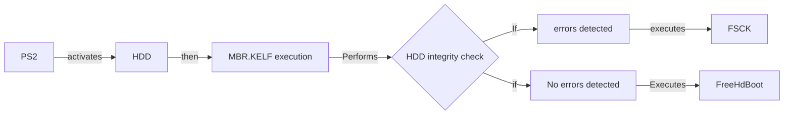

# extra information 

## FreeHdBoot startup

```mermaid
flowchart LR
A[PS2] -->|activates| B[HDD];
B -->|then| C[MBR.KELF execution];
C -->|Performs| D{HDD integrity check};
D -->|If| E[errors detected];
D -->|if| G[No errors detected];
E -->|executes| F[FSCK];
G -->|Executes| H[FreeHdBoot];
```
